# Study Plan: Building obs-summarizer from Scratch

This project is a Python ETL pipeline that scans an Obsidian vault, summarizes each markdown note via LLM (Claude or local Ollama/LM Studio), and writes a structured daily digest back into the vault. Understanding it requires mastery of Python packaging, file-system manipulation, LLM SDK integration, structured prompt engineering, and several production-grade reliability patterns (atomic writes, content-addressable caching, exponential backoff retry).

---

## Dependency Tree

```mermaid
graph TD
    subgraph "Phase 1 — Python Tooling"
        PKG["Python Packaging\n(pyproject.toml, setuptools,\neditable installs, entry points)"]
        CLI["CLI with argparse\n(subcommands, flags,\nexit codes)"]
        TEST["pytest + mocking\n(fixtures, MagicMock,\nlambda stubs)"]
        LINT["ruff + mypy\n(type annotations,\nstrict mode)"]
    end

    subgraph "Phase 2 — File System & Persistence"
        FS["pathlib API\n(glob, resolve, relative_to,\nst_mtime_ns)"]
        JSON["JSON + atomic writes\n(json.load/dump,\ntemp-file rename)"]
        HASH["hashlib content addressing\n(sha256, hex digest,\ncache key design)"]
    end

    subgraph "Phase 3 — Configuration & Security"
        YAML["PyYAML + validation\n(safe_load, custom exceptions,\ndefault values)"]
        ENV["Secrets via env vars\n(os.environ, never in config,\nboundary validation)"]
        PATH_SEC["Path traversal defense\n(resolve + relative_to,\nreject absolute paths)"]
    end

    subgraph "Phase 4 — ETL Architecture"
        ETL["ETL pipeline pattern\n(Extract→Transform→Load,\norchestrator module)"]
        CHECKPOINT["Checkpoint / incremental state\n(last_run_iso, since-datetime\npriority chain)"]
        CACHE["Content-addressable cache\n(sha256 key, mtime invalidation,\nsilent miss on corrupt)"]
    end

    subgraph "Phase 5 — LLM Integration"
        ANTHRO["Anthropic SDK\n(messages.create, system/user,\nRateLimitError)"]
        OAI["OpenAI SDK (local backend)\n(LM Studio / Ollama,\nchat.completions.create)"]
        RETRY["Exponential backoff retry\n(attempt loop, 2^n wait,\nwrap third-party errors)"]
        FACTORY["Factory + Callable interface\n(create_llm_client, Callable[[str,str],\nLLMResponse])"]
    end

    subgraph "Phase 6 — Prompt Engineering & Output Parsing"
        PROMPT["Structured JSON prompts\n(system vs user roles,\nfew-shot examples)"]
        PARSE["LLM JSON extraction\n(direct parse, brace extraction,\ntwo-shot retry)"]
        FRONTMATTER["Markdown + YAML frontmatter\n(strip, generate, Obsidian conventions)"]
    end

    PKG --> CLI
    PKG --> TEST
    PKG --> LINT
    CLI --> ETL
    FS --> CACHE
    FS --> CHECKPOINT
    JSON --> CHECKPOINT
    JSON --> CACHE
    HASH --> CACHE
    YAML --> ENV
    ENV --> PATH_SEC
    PATH_SEC --> ETL
    YAML --> ETL
    CACHE --> ETL
    CHECKPOINT --> ETL
    ANTHRO --> FACTORY
    OAI --> FACTORY
    RETRY --> FACTORY
    FACTORY --> ETL
    PROMPT --> PARSE
    PARSE --> ETL
    FRONTMATTER --> ETL
    TEST --> ETL
```



---

## Phase 1 — Python Tooling

**Goal:** Be able to build, install, test, and lint a Python project with a proper CLI entry point.

| Topic | What to master | Resource starting point |
|---|---|---|
| pyproject.toml | `[project]`, `[project.scripts]`, `[project.optional-dependencies]`, `requires-python` | [Python Packaging User Guide](https://packaging.python.org/en/latest/guides/writing-pyproject-toml/) |
| Editable installs | `pip install -e ".[dev]"`, how `src/` layout works, why editable is used in dev | [Setuptools docs — src layout](https://setuptools.pypa.io/en/latest/userguide/package_discovery.html#src-layout) |
| Entry points | `[project.scripts]` → `module:function`, how `obs-digest` becomes a shell command | Same packaging guide above |
| argparse | `add_argument`, `action="store_true"`, `default`, parsing and dispatch | [argparse docs](https://docs.python.org/3/library/argparse.html) |
| Exit codes | `sys.exit(0/1/2)`, returning ints from `main()` | [POSIX exit code conventions](https://www.gnu.org/software/bash/manual/html_node/Exit-Status.html) |
| pytest fixtures | `@pytest.fixture`, `tmp_path`, `conftest.py`, fixture composition | [pytest docs — fixtures](https://docs.pytest.org/en/stable/how-to/fixtures.html) |
| Mocking LLM calls | `MagicMock`, lambda stubs, `Callable[[str,str], LLMResponse]` | [unittest.mock docs](https://docs.python.org/3/library/unittest.mock.html) |
| ruff | `ruff check`, selecting rule sets (E, F, W, I, UP), fixing auto | [ruff docs](https://docs.astral.sh/ruff/) |
| mypy strict mode | `strict = true`, `Optional`, `Dict`, `List`, `Callable` annotations | [mypy docs](https://mypy.readthedocs.io/en/stable/) |

**Checkpoint:** Build a tiny CLI tool (`greeter`) with `pyproject.toml`, one entry point (`greet --name Alice`), one pytest test that checks exit code, and mypy passing. Install it with `pip install -e .` and run it.

---

## Phase 2 — File System & Persistence

**Goal:** Read, filter, and write files robustly using content-based addressing and atomic persistence.

| Topic | What to master | Resource starting point |
|---|---|---|
| pathlib | `Path.glob("**/*.md")`, `.resolve()`, `.relative_to()`, `.stat().st_mtime_ns`, `.mkdir(parents=True)` | [pathlib docs](https://docs.python.org/3/library/pathlib.html) |
| mtime and nanoseconds | `st_mtime` vs `st_mtime_ns`, timezone-aware datetimes from timestamps | [os.stat_result docs](https://docs.python.org/3/library/os.html#os.stat_result) |
| JSON serialization | `json.load`, `json.dump`, `indent=2`, handling `JSONDecodeError` | [json docs](https://docs.python.org/3/library/json.html) |
| Atomic file writes | Write to temp file (`tempfile.NamedTemporaryFile`), then `Path.replace()` — avoids partial writes on crash | [tempfile docs](https://docs.python.org/3/library/tempfile.html) |
| hashlib content addressing | `hashlib.sha256(data.encode()).hexdigest()`, choosing a cache key that captures identity | [hashlib docs](https://docs.python.org/3/library/hashlib.html) |
| Glob pattern exclusion | `vault.glob("**/.obsidian/**")`, building exclusion sets, checking `is_file` vs `is_dir` | pathlib docs above |

**Checkpoint:** Write a script that scans a test directory for `*.md` files, computes a SHA256 cache key per file using path + mtime_ns, writes each key to a JSON cache file, and detects which files changed on re-run (cache miss = file changed). Use atomic writes for the cache.

---

## Phase 3 — Configuration & Security

**Goal:** Load and validate YAML config safely, reject secrets in config files, and prevent path traversal.

| Topic | What to master | Resource starting point |
|---|---|---|
| PyYAML | `yaml.safe_load` (never `load`), `YAMLError`, None-safe defaults | [PyYAML docs](https://pyyaml.org/wiki/PyYAMLDocumentation) |
| Custom exceptions | `class ConfigError(Exception): pass`, raising with context, chaining with `from e` | [Python exceptions tutorial](https://docs.python.org/3/tutorial/errors.html) |
| Config validation pattern | Required fields, type checks, `.setdefault()` for defaults, failing fast with clear messages | — |
| Environment variables for secrets | `os.environ.get("ANTHROPIC_API_KEY")`, refusing config-file keys, validating at load time | [os.environ docs](https://docs.python.org/3/library/os.html#os.environ) |
| Path traversal defense | `path.resolve()` to canonicalize, then `resolved.relative_to(vault.resolve())` — raises `ValueError` if outside | pathlib docs |
| Reject absolute paths | `Path(val).is_absolute()` check for write destinations (`cache_dir`, `state_path`) | — |

**Checkpoint:** Build a `load_config()` that reads a YAML file, validates three required fields, sets defaults for two optional fields, raises `ConfigError` if an `api_key` key is present, and raises `ConfigError` if a path tries to escape a specified root directory.

---

## Phase 4 — ETL Architecture

**Goal:** Design and implement an incremental Extract-Transform-Load pipeline with checkpointing and content-addressed caching.

| Topic | What to master | Resource starting point |
|---|---|---|
| ETL pattern | Separate Extract (scanner), Transform (summarizer), Load (writer) modules; orchestrator calls them in sequence | [Martin Fowler — ETL overview](https://martinfowler.com/articles/patterns-of-distributed-systems/) |
| Incremental processing | Checkpoint stores last successful run time; next run only processes files modified after that time | — |
| Since-datetime priority chain | CLI arg → config → checkpoint → fallback (now); each level overrides the next | — |
| Dry-run mode | Accept all config, discover files, print them, return 0 — never call LLM | — |
| Cache read-before-compute | Check cache first (cache hit = skip LLM call); save to cache after successful LLM call | — |
| Checkpoint-after-success | Write `last_run_iso` only after digest is successfully written, never before | — |
| Error handling in loops | Catch expected errors per-file (skip that file), re-raise unexpected errors (stop pipeline) | — |
| Exit code semantics | 0 = success, 1 = pipeline error, 2 = no files found | — |

**Checkpoint:** Build a simplified ETL that scans a directory for `.txt` files modified since a checkpoint, "transforms" each by counting words (write result to a dict), "loads" by writing a summary report, then saves a checkpoint. Run twice to confirm the second run skips already-processed files.

---

## Phase 5 — LLM Integration

**Goal:** Call Claude and local LLM backends through a unified interface with retry, timeout, and proper error handling.

| Topic | What to master | Resource starting point |
|---|---|---|
| Anthropic SDK | `anthropic.Anthropic(api_key=..., timeout=...)`, `client.messages.create(model, max_tokens, system, messages)`, `.content[0].text` | [Anthropic Python SDK docs](https://docs.anthropic.com/en/api/getting-started) |
| System vs user messages | `system=` param in Claude API vs `messages=[{"role":"system",...}]` in OpenAI-compatible APIs | Anthropic docs |
| RateLimitError + APITimeoutError | `anthropic.RateLimitError`, `APIConnectionError`, `APITimeoutError` — each needs different handling | [Anthropic error types](https://docs.anthropic.com/en/api/errors) |
| OpenAI SDK (local backend) | `openai.OpenAI(base_url=..., api_key="not-needed")`, `chat.completions.create`, `.choices[0].message.content` | [OpenAI Python SDK](https://platform.openai.com/docs/libraries) |
| Exponential backoff retry | `for attempt in range(3)`, `wait = 2 ** (attempt + 1)`, `time.sleep(wait)`, re-raise on last attempt | — |
| Factory pattern returning Callable | `def create_llm_client(config) -> Callable[[str, str], LLMResponse]` — callers get a function, not an object | — |
| `@dataclass` | `@dataclass class LLMResponse: content: str` — minimal typed response wrapper | [dataclasses docs](https://docs.python.org/3/library/dataclasses.html) |

**Checkpoint:** Write a `create_client(backend)` factory that returns either a `call_claude` or `call_local` function. Both must accept `(system: str, user: str) -> str`. Write a test that stubs both with lambdas and verifies the right one is returned based on `backend`.

---

## Phase 6 — Prompt Engineering & Output Parsing

**Goal:** Reliably extract structured JSON from LLM responses and produce well-formatted Markdown for Obsidian.

| Topic | What to master | Resource starting point |
|---|---|---|
| Structured JSON prompts | "Return ONLY valid JSON", provide field definitions, include a complete example in the system prompt | [OpenAI structured output guide](https://platform.openai.com/docs/guides/structured-outputs) |
| Few-shot examples in prompts | Embedding a complete working example in the system prompt dramatically reduces malformed output | — |
| JSON extraction from prose | `text.find("{")` + `text.rfind("}")` + `json.loads(text[start:end+1])` as fallback when direct parse fails | — |
| Two-shot retry on parse failure | First call with permissive prompt; if JSON parse fails, second call with stricter prompt demanding raw JSON | — |
| YAML frontmatter | `---\nkey: value\n---\n` prefix format, how to strip it (`text.split("---", 2)`), how to generate it | [Obsidian frontmatter docs](https://help.obsidian.md/Editing+and+formatting/Properties) |
| Input truncation | `text[:max_chars] + "\n[... truncated]"` to stay within LLM token limits | — |
| Content grouping by tag | Use first tag from `summary["tags"]` as theme key, group articles by theme for digest output | — |

**Checkpoint:** Write a `parse_llm_json(text: str) -> dict` function that handles: (1) clean JSON response, (2) JSON embedded in prose with preamble, (3) raises `ValueError` on unparseable input. Write unit tests for all three cases — no LLM needed.

---

## Project-Specific Patterns

### 1. Factory + Callable Interface (llm.py)

**What it is:** `create_llm_client(config)` returns a `Callable[[str, str], LLMResponse]` — a plain function, not an object. Both Claude and local backends are closures over their respective SDK clients.

**Why over a class hierarchy:** Callers only need `llm_call(system, user)`. No methods, no inheritance. Tests stub it with a one-liner: `llm_call = lambda s, u: LLMResponse(content='{"summary":"test"}')`.

**Minimal structure:**
```python
def create_llm_client(config: Dict) -> Callable[[str, str], LLMResponse]:
    if config["llm_backend"] == "claude":
        return _create_claude_client(config)
    return _create_local_client(config)

def _create_claude_client(config) -> Callable[[str, str], LLMResponse]:
    client = anthropic.Anthropic(api_key=os.environ["ANTHROPIC_API_KEY"])
    def call_claude(system: str, user: str) -> LLMResponse:
        ...
    return call_claude
```

**What breaks if you skip it:** Any change to the LLM backend (swap Claude for Gemini) requires touching every call site, not just the factory.

---

### 2. Content-Addressable File Cache (cache.py)

**What it is:** Cache key = `sha256(file_path + ":" + mtime_ns)`. Stored as `{cache_dir}/{key}.json`. A file modified after caching generates a new key (old entry is orphaned, not deleted).

**Why mtime_ns over mtime:** Nanosecond precision eliminates false cache hits where two writes happen in the same second.

**Why sha256 over path as filename:** Paths contain slashes and special characters unsafe for filenames. The hash is fixed-length and filesystem-safe.

**What breaks if you skip it:** Every run re-calls the LLM for every note, burning API credits and adding latency proportional to vault size.

---

### 3. Atomic State Writes (state.py)

**What it is:** Write to a `NamedTemporaryFile` in the same directory, then call `Path(tmp).replace(state_path)`. On POSIX, `os.rename` is atomic.

**Why the same directory matters:** `rename` is only atomic when source and destination are on the same filesystem. Writing the temp file elsewhere could require a copy across filesystems.

**What breaks if you skip it:** A crash mid-write leaves a partially-written `state.json`. Next run reads corrupt JSON and either silently treats it as first-run (losing checkpoint) or crashes.

---

### 4. Since-Datetime Priority Chain (state.py)

**What it is:** `get_since_datetime()` resolves from four sources in strict priority order: CLI arg → config file → state checkpoint → `datetime.now()` (first run).

**Why "now" as the first-run default:** Prevents accidentally processing the entire vault history on first run. Users must explicitly pass `--since DATE` to backfill.

**What breaks if you skip it:** Ambiguous semantics — does `since` mean "from the config" or "from last run"? Bugs emerge when the wrong source wins.

---

### 5. Two-Shot LLM JSON Retry (summarizer.py)

**What it is:** First attempt uses a detailed prompt with a full JSON example. If `_parse_json` raises `ValueError`, a second call with a stripped-down, stricter "JSON only" prompt is made.

**Why not just one strict prompt:** Permissive prompts with examples generally produce better semantic summaries. The retry is a fallback for the small fraction of malformed responses.

**What breaks if you skip it:** Any LLM response with a preamble ("Sure! Here's your JSON:") fails permanently. In production over hundreds of notes, this happens regularly.

---

### 6. Path Traversal Defense Pattern (scanner.py, digest_writer.py)

**What it is:**
```python
resolved = (vault / user_supplied_folder).resolve()
resolved.relative_to(vault.resolve())  # raises ValueError if outside vault
```

**Why `resolve()` before `relative_to()`:** Without resolving, `../../../etc/passwd` passes string comparison but escapes the vault. `resolve()` expands symlinks and `..` components first.

**What breaks if you skip it:** A user with a malicious config (or a bug in config parsing) could scan or write to arbitrary filesystem locations outside the vault.

---

## Common Mistakes to Avoid

| Mistake | Correct Pattern |
|---|---|
| `api_key` in `config.yaml` | Always read from `os.environ.get("ANTHROPIC_API_KEY")` — reject key in config at load time |
| `mtime` (float seconds) for cache key | Use `mtime_ns` (int nanoseconds) — avoids false hits in same-second writes |
| Write state before digest write succeeds | Write checkpoint only after `write_digest_note()` returns successfully |
| `Path(vault / folder)` without `resolve()` | Always `.resolve()` then `.relative_to(vault.resolve())` for user-supplied paths |
| Direct `json.loads(llm_response)` | Use `_parse_json` with brace-extraction fallback + two-shot retry |
| `yaml.load()` | Always `yaml.safe_load()` — `yaml.load()` allows arbitrary Python execution |
| Swallowing all exceptions in the file loop | Catch known errors (`ValueError`, `KeyError`, `OSError`) and skip; re-raise `Exception` to stop pipeline |
| Absolute `cache_dir` or `state_path` | Validate both are relative paths — prevents writing to system locations |
| First run processing entire vault | Default `since` to `datetime.now()` on first run; require `--since DATE` for backfill |
| Cross-filesystem temp file for atomic rename | Write temp file to `path.parent` (same dir as destination) so rename stays on one filesystem |

---

## Reference Materials

| Resource | Link |
|---|---|
| Anthropic Python SDK | https://docs.anthropic.com/en/api/getting-started |
| Claude Messages API | https://docs.anthropic.com/en/api/messages |
| Anthropic error types | https://docs.anthropic.com/en/api/errors |
| OpenAI Python SDK | https://platform.openai.com/docs/libraries |
| LM Studio local server | https://lmstudio.ai/docs/local-server |
| Ollama API | https://github.com/ollama/ollama/blob/main/docs/api.md |
| Python pathlib | https://docs.python.org/3/library/pathlib.html |
| Python hashlib | https://docs.python.org/3/library/hashlib.html |
| Python tempfile | https://docs.python.org/3/library/tempfile.html |
| Python argparse | https://docs.python.org/3/library/argparse.html |
| PyYAML | https://pyyaml.org/wiki/PyYAMLDocumentation |
| pytest fixtures | https://docs.pytest.org/en/stable/how-to/fixtures.html |
| ruff linter | https://docs.astral.sh/ruff/ |
| mypy type checker | https://mypy.readthedocs.io/en/stable/ |
| Python Packaging User Guide | https://packaging.python.org/en/latest/guides/writing-pyproject-toml/ |
| Obsidian frontmatter | https://help.obsidian.md/Editing+and+formatting/Properties |
